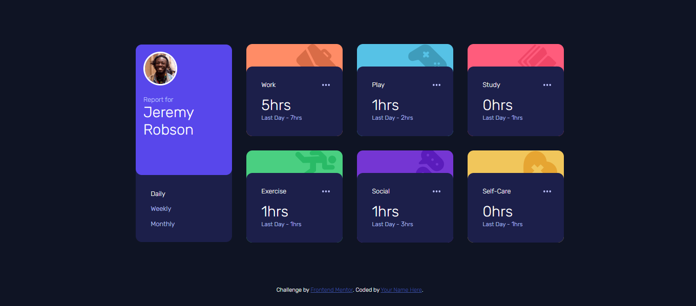

# Frontend Mentor - Time tracking dashboard solution

This is a solution to the [Time tracking dashboard challenge on Frontend Mentor](https://www.frontendmentor.io/challenges/time-tracking-dashboard-UIQ7167Jw). Frontend Mentor challenges help you improve your coding skills by building realistic projects. 

## Table of contents

- [Frontend Mentor - Time tracking dashboard solution](#frontend-mentor---time-tracking-dashboard-solution)
  - [Table of contents](#table-of-contents)
  - [Overview](#overview)
    - [The challenge](#the-challenge)
    - [Screenshot](#screenshot)
    - [Desktop Version](#desktop-version)
    - [Links](#links)
  - [My process](#my-process)
    - [Built with](#built-with)
  - [Author](#author)

## Overview

### The challenge

Users should be able to:

- View the optimal layout for the component depending on their device's screen size
- See the social media share links when they click the share icon

### Screenshot

### Desktop Version

### Links

- Solution URL: [https://github.com/Alfeyn/time-tracking-dashboard](https://github.com/Alfeyn/time-tracking-dashboard)
- Live Site URL: [https://alfeyn.github.io/time-tracking-dashboard/](https://alfeyn.github.io/time-tracking-dashboard/)

## My process

### Built with

- Semantic HTML5 markup
- CSS custom properties
- Flexbox
- Grid
- Mobile-first workflow
- Responsive design
- Vanilla JS
- event handling
- JS DOM
- Data Fetching

## Author

- Frontend Mentor - [@yourusername](https://www.frontendmentor.io/profile/@Alfeyn)
- Discord - [@harfel_alif](https://discord.com/channels/@harfel_alif)